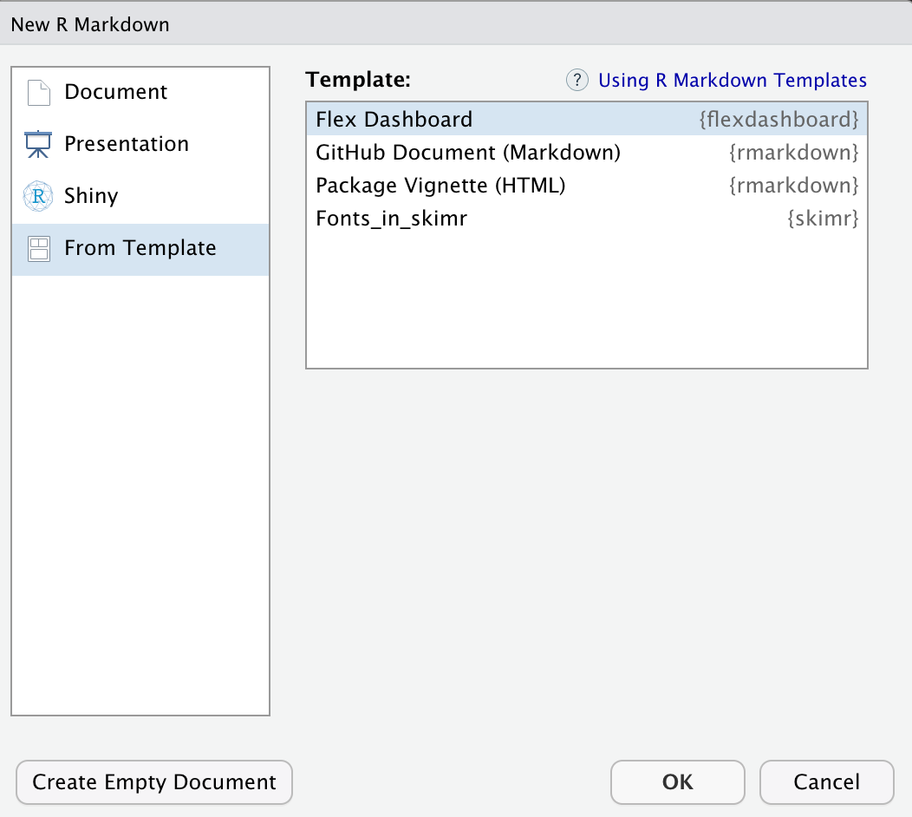
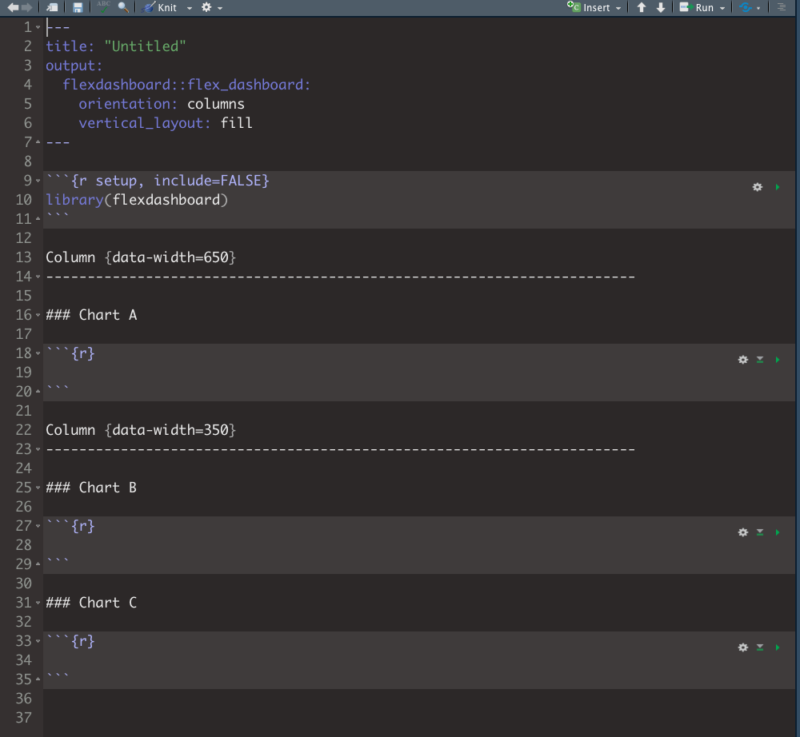
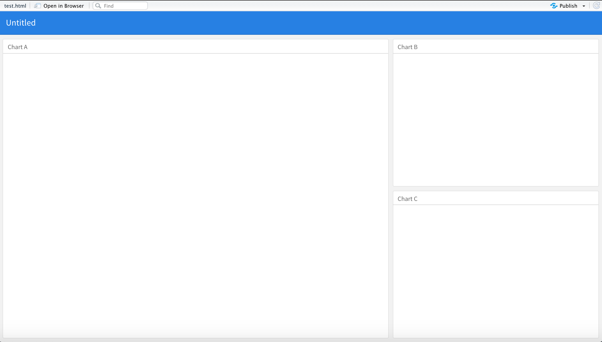
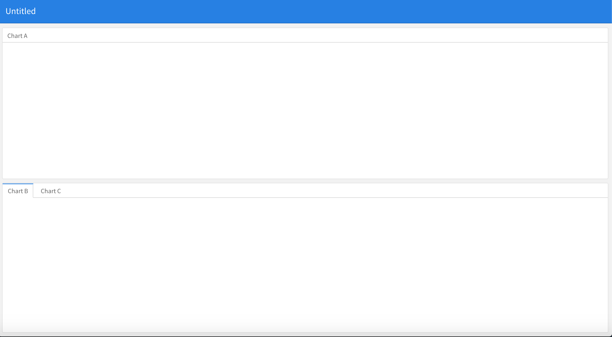
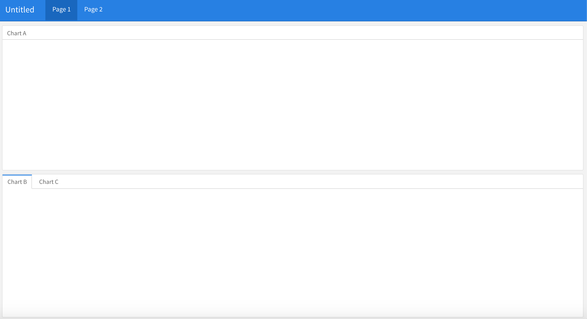
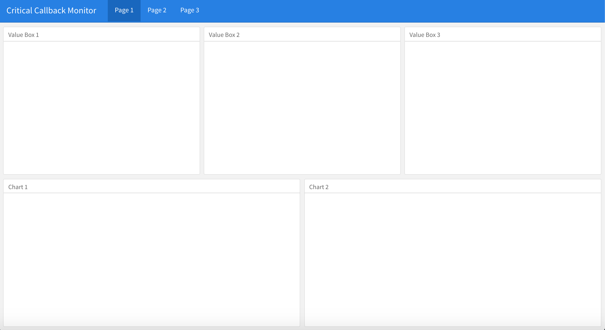
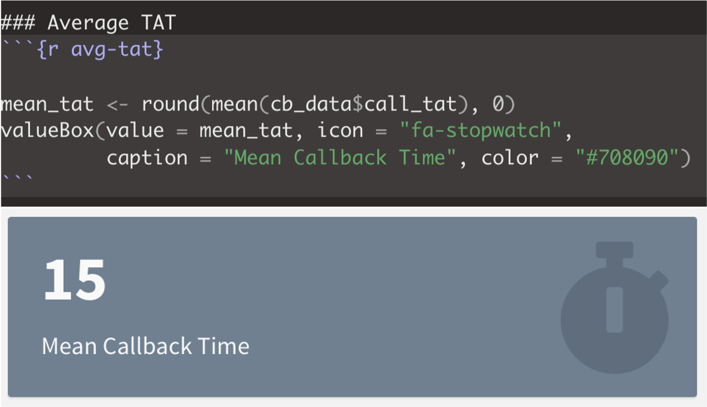
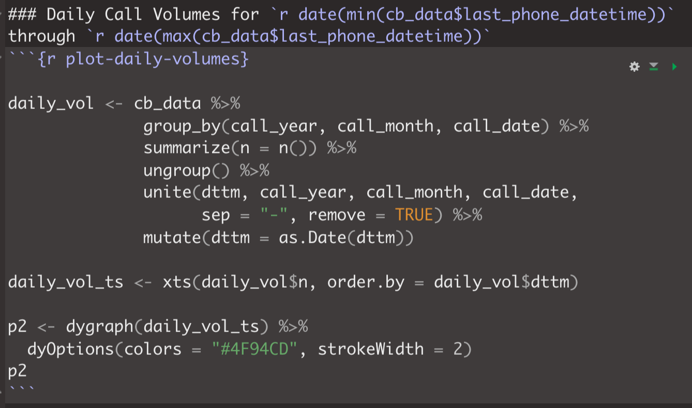
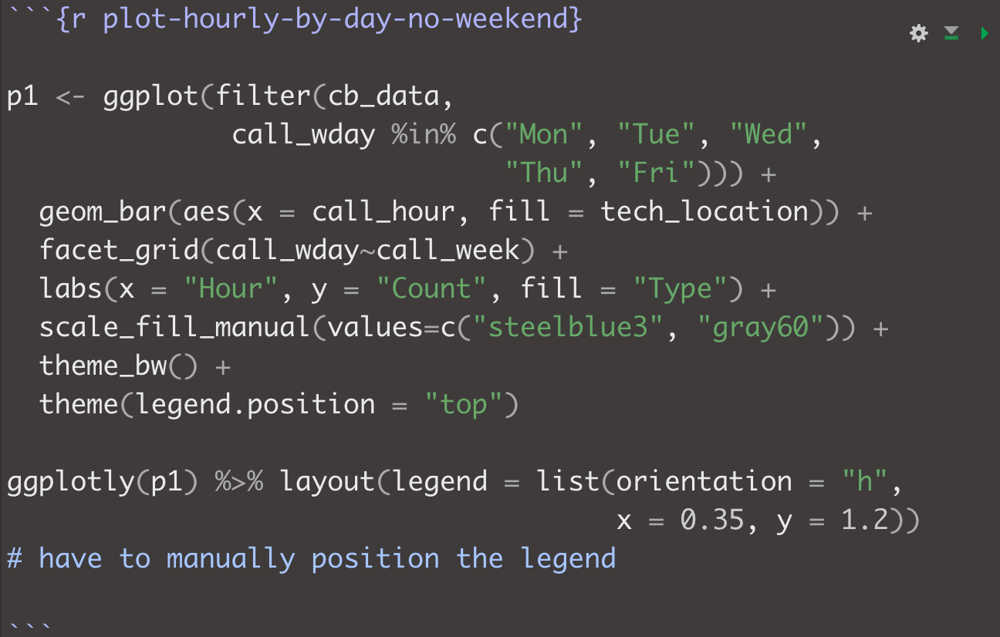
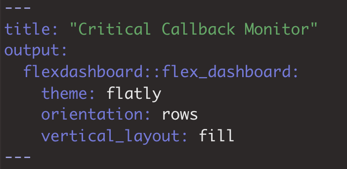

```{r setup, include=FALSE}
knitr::opts_chunk$set(echo = TRUE)
```

## What is `flexdashboard`?
`flexdashboard` is an R package that we can use to create dashboards, which organize, store, and display important information into one, easy-to-access place. We can create static (i.e., a standard web page) or dynamic (i.e., a Shiny responsive document) flexdashboards. A great deal of customization and functionality is made possible with various components that can be added to the different flexdashboard layouts. These components include:    

* Interactive JavaScript data visualizations  
* R graphical output  
* Tabular data  
* Value boxes  
* Gauges  
* Text annotations  
* Images or icons  

There are also several layouts that can be used for flexdashboards. The `flexdashboard` website shows several samples and provides the code, which can be used as a starting place for your own dashboard. The layouts are easy to modify and customize.  [Example flexdashboards](https://rmarkdown.rstudio.com/flexdashboard/examples.html)

We will explore these options later as we build our own flexdashboard.  

## Getting started with `flexdashboard`

To author a flexdashboard, you first have to install the `flexdashboard` package, using `install.packages("flexdashboard")`.  

Now we will see the option to choose flexdashboard as an output for a new Rmd file. We author flexdashboards as Rmd documents.  

### Open a new flexdashboard  
1. From RStudio, select File >> New File >> R Markdown...  

2. Choose From Template and select the Flex Dashboard template.  

```{r open-new, echo = FALSE, out.width = "75%"}

```

This opens a new Rmd file that is structured as a flexdashboard. You should notice that this looks different than a new R Markdown or R Notebook file.  

```{r new-db, echo = FALSE, out.width = "80%"}

```

The very top section is the YAML. We see there are options specifying that this document will have flexdashboard output using column orientation that fills vertically. Next, we see the setup chunk that loads the `flexdashboard` package. The next sections define the layout, sizes, and content for the different areas of the dashboard.

Let's render this document to see what this layout looks like.  

Go to Knit >> Knit to flex_dashboard, save the file into your local directory with a name of your choice. This opens a new window showing the HTML output of our dashboard. Right now we have three designated areas arranged into two columns. The first column contains an area for Chart A and the second column has places for Chart B and for Chart C.  

```{r knit-db, echo=FALSE, out.width = "75%"}

```


### Select a layout
Because dashboards are typically designed as webpages, we should think about the layouts in terms of viewing in a web browser. Dashboards can be arranged in rows or columns or both. Depending on the layout, we may choose to have the content fill the page vertically, resizing based on the size of the page, or have content maintain its original height through page scrolling.  

Let's see how the orientation and vertical_fill options work for flexdashboards.  

#### Row formats  
To change the layout to arrange content in rows versus columns:  

1. Change the orientation option to rows.
2. Change the headers of the sections from Column to Row . 
3. Knit your document.

Let's look at the effect of these changes.  

```{r row-db, echo=FALSE, out.width = "75%"}
knitr::include_graphics("images/row_db.png")
```

R will automatically divide up the available space among the number of visualizations/components you create within a row (or column), unless you explicitly specify the size of the component. You can also define the relative sizes of the row and column containers for your dashboard.    

#### Scrolling vertical layout  
For formats that may span more than a single page length, we can use the scrolling vertical format.  

1. Modify the vertical_layout option to scroll.
2. Knit your document.

Let's look at the effect of this change.  


We'll change the vertical_layout option back to fill, as this is a more suitable format for our example.  

#### Tabset and multiple page layouts  
Sometimes you have too much content for a single page, you want to create a dashboard with multiple areas of emphasis, or focus or a need to toggle between two components. In these cases, you are best to use a tabset or multiple page format. Tabsets can be thought of as creating multiple pages within a row or column. Dashboards with multiple pages can have the same or different layouts on each page. For our example, we will use a multiple page layout. 

##### Tabset  
To add a tabset, we add the {.tabset} attribute to the section heading where we want to create the tab.  

Let's try this for our test layout:  

1. Add {.tabset} to the second Row heading  
2. Knit your document.  


```{r tabset, echo=FALSE, out.width = "75%"}

```


##### Multiple pages  
If we want to add multiple pages, we use ================= at the point where we want a page to begin. 

To create two pages in our test layout, we'll add the following just above the first Row section:  


```{r add-p1, eval = FALSE}
Page 1
===================
```


and this after the second chart of the second Row section:  

```{r add-p2, eval=FALSE}
Page 2
==================

Row
------------------
 
### Chart A

```


Let's knit our document to see the effect of these changes. We should see a dashboard with two pages, each with its own top-level navigation tab. The first page will have two rows with three charts, including the tabset charts. The second page has a single row and chart.  


```{r pages, echo=FALSE, out.width = "75%"}

```

#### Setting up the structure for our example  
The critical callback monitor dashboard layout uses three pages, each containing two rows. Let's create a new layout with containers for the components of our dashboard.   

Row 1 on each page contains three 'Value Box' components. Row 2 on each page contains two items, which vary, depending on the page.  

1. Open a new flexdashboard and title it "Critical Callback Monitor"  
  
2. Configure your dashboard to have 3 pages, with rows orientation and the fill vertical layout, as follows:  
    + Page 1, Row 1: 3 Value Boxes  
    + Page 1, Row 2: Chart 1 and Chart 2  
    + Page 2, Row 1: 3 Value Boxes  
    + Page 2, Row 2: Chart 1 and Table 1  
    + Page 3, Row 1: 3 Value Boxes  
    + Page 3, Row 2: Chart 1 and Table 1  

> *Hint: You should be able to copy/paste your code for page 1 and modify for page 2 and then copy/paste page 2 and modify for page 3*  

3. Create a label for each component using a level 3 header (### Label).  

4. Knit your document and check that you have the right setup.  


```{r callbk, echo=FALSE, out.width = "75%"}

```


#### Loading the packages and data set for our example
Before we can build our dashboard, we need to get the necessary packages and data loaded. Refer to the provided example Rmd (callback_db.Rmd) for this code.  


### Adding components  
The components of the dashboard are the pieces that display your content. As mentioned earlier, there is a wide variety of options to choose from, including both static and interactive components. We don't have time to learn about all of them in this session. You are encouraged to refer to the flexdashboard documentation and provided links to explore and experiment further.  

#### Value boxes  
Dashboards commonly include one or more graphics displaying simple values often with an icon and descriptive title. The `flexdashboard` package includes a `valueBox()` function that creates this type of display.  

*Color*
Value boxes can also be configured to color based on a condition. Colors can be specified in terms relevant to business intelligence displays, such as “primary”, “info”, “success”, “warning”, and “danger” (the default is “primary”). You can also apply custom colors by specifying any valid CSS color as hexadecimal or RGB notation. Note: CSS colors are not the same as the colors available in R, though there is overlap.  

*Icons*
You can specify icons from three different icon sets:  
* [Font Awesome](https://fontawesome.com/icons)  
* [Ionicons](https://ionicons.com/)   
* Bootstrap Glyphicons   


Icons are specified using their full name, including the icon set prefix (e.g. “fa-github”, “ion-social-twitter”, “glyphicon-time”, etc.). Icons can also be added to page headers, as we'll see in our example.  


Value box syntax:  

```{r vbox, echo=FALSE, out.width = "75%"}

```

Let's try it:  
1. Complete the code below to create a value box to display the total number of calls (as calls <- cb_data %>% nrow())  

2. Include the icon "fa-hashtag" and make the color "warning"  

3. Title the value box "Total calls"  


```{r, eval = FALSE}
calls <- cb_data %>% nrow()
______(value = _____, icon = ______, 
       caption = _______, color = ______)

```


Refer to the provided example Rmd (callback_db.Rmd) for the completed code to create the three value boxes on Pages 1, 2, and 3.  

#### R graphics
Any chart created with standard R graphics can be used in a flexdashboard. The syntax is the same as used in R Markdown and is specified within the container you wish it to appear. R will scale the graphic to preserve the aspect ratio, but since these are PNG images, they will not automatically fill the bounds of their containers. Therefore, you must define the `knitr` options for `fig.width` and `fig.height` to match the size of the container on the page. Unfortunately the ideal values are usually determined through experimentation. This is why it may be desirable to render R `ggplot2` graphics using the `plotly` htmlwidget. We'll learn about using `ggplotly` below.  

#### HTML widgets
The htmlwidgets framework provides high-level R bindings for JavaScript data visualization libraries. Charts based on htmlwidgets are well-suited for flexdashboard because they dynamically re-size and are interactive. The [htmlwidgets website](https://www.htmlwidgets.org/) has more information about the available HTML widgets. In this session, we will learn about  

> `dygraphs`, for charting time-series data and includes support for many interactive features includingseries/point highlighting, zooming, and panning

> `highcharter`, a rich R interface to the popular Highcharts JavaScript graphics library

> `plotly`, uses a ggplotly interface to easily translate your ggplot2 graphics to an interactive web-based version

Each of these packages has their own syntax, but code for htmlwidgets is written within chunks in R Markdown, similarly to what is done for other types of R plots. A review of the available documentation for each htmlwidget will provide the required syntax for plots and customization.   

Let's review the code used to create the daily call volumes graph, produced using the `dygraphs` widget. This plot allows zooming in, highlighting, and provides the volume for a given date when moused over -- all baked into the single `dygraphs()` call! Underlying this call is a lot of JavaScript code to create this plot and make it interactive. We specified a custom color and line width using the `dyOptions()` call.  
  
```{r dygraph, echo=FALSE, out.width = "75%"}

```
  
As mentioned above, it may be preferable to convert `ggplot2` plots into `plotly` graphs so they render better on dashboards. This is pretty straightforward to do. You write the code for your ggplot graphic as you normally would and pass this code to `ggplotly()`. As above with the `dygraph` above, we can see how the htmlwidgets framework provides us with a lot of JavaScript functionality with very little code. However, there is a quirky thing that happens with the legend positioning. This must be manually specified for the `plotly` graphic using the `layout()` function.  

Let's review this for our critical callback example:  

```{r plotly, echo=FALSE, out.width = "75%"}

```

Refer to the provided sample Rmd (callback_db.Rmd) for the completed code to create the `highcarter` figure on Page 2 for another example of an htmlwidget plot.  

#### Tables
The last type of component we'll discuss in this session is that for tabular data. Tables can be included as simple, static displays or as interactive tables with capabilities for sorting, filtering, and pagination.  

Let's compare the code used to create static and interactive tables for flexdashboards:  

##### Static tables  
To create a static table, we use the `kable` or `kableExtra` packages:  
```{r cc-overdue, eval = FALSE}
cc_late <- cb_data %>% 
  filter(tech_location == "CallCenter", call_tat >30) %>%
  select(call_tat, accession, pt_type, pt_loc_code, test_code,
         result_datetime, phoned_title, tech)

knitr::kable(cc_late) %>% kable_styling()

```

##### Interactive tables  
For tables that are interactive, we use the `DataTables` package:  

```{r cc-overdue-in, eval = FALSE}
cc_late <- cb_data %>% 
  filter(tech_location == "CallCenter", call_tat >30) %>%
  select(call_tat, accession, pt_type, pt_loc_code, test_code,
         result_datetime, phoned_title, tech)

datatable(cc_late, options = list(pageLength = 20, autoWidth = TRUE))

```
  
### Themes  
Additional customization is possible using themes. Our critical callback dashboard uses the default theme, cosmo. The available themes are the same ones in the R Markdown package, which were mentioned in our first session. This [blog post](https://www.datadreaming.org/post/r-markdown-theme-gallery/) shows each theme for comparison.  

The theme is set using the theme option in the YAML. Because we are using the default in the sample dashboard, the theme is not specified.    

```{r theme, echo = FALSE, out.width = "45%"}

```

Let's try it:  

1. Select a theme and modify the YAML of your flexdashboard to change its theme.  

2. Knit your document to view the difference in the look.  


### Reviewing the sample flexdashboard code
Please open the callback_db.Rmd file and the callback_db.html file. We will review the code and examine the output.  


