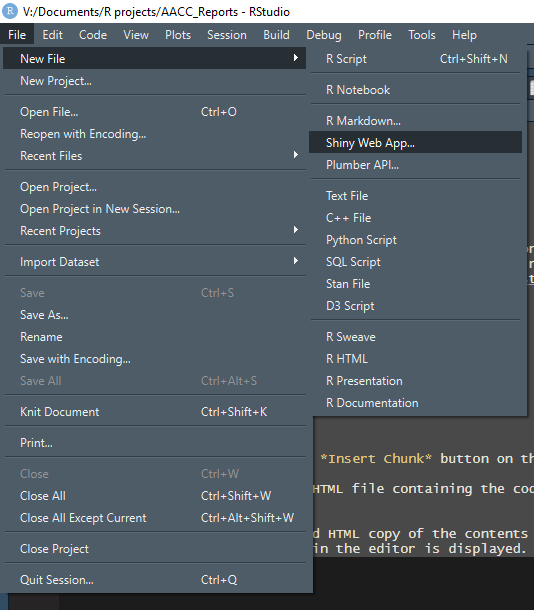

```{r setup, include=F}
knitr::opts_chunk$set(fig.pos = "!H", fig.height = 6, out.extra = "")
```
# **What is shiny?**

_shiny_ is a R package that can be used to create applications that can be hosted on a server. These applications are interactive and allow the user manipulate their data in real time as well as create reports of the data if the need arises. These applications are very customizable while still being relatively easy to use. 

<https://shiny.rstudio.com/gallery/>.


# **Getting Started with Shiny**

First you need to install the shiny package.  

`` install.packages("shiny") ``

After the package is installed there will be the option to create a New File > Shiny Web App.

\  

After selecting Shiny Web App, a pop-up will open.

\  

Application Name and dierctory is at the will of the user. However, Application Types has two options. Shiny Apps are composed of two components. The first is the user interface which includes how the app will look, what is included, and other UI issues. The second component is the server portion which connects to the server and updates the available information based on input from the UI side. Originally, Shiny Apps were composed of two indepent files (ui.R and server.R). Newer version of the shiny use a single file (app.R) that contains two section.

Shiny applications that run on a server will only run from an app.R or a ui.R/server.R files.

Select the single file option. 

I named my app 2020_AACC. If you look in your file window you can see that a new folder was created to hold all of the data needed for the shiny application. 

\  

Currently, the only thing in the folder is app.R

\  

Upon opening a demo shiny app is created from which we can begin building our own, 

\


but before we begin let us run the current app as it is. Select the green arrow Run App to the top right corner where the run button usually is.

\

When you run the app a simple application runs that allows someone to change the number of bins used in a histogram for the frequency of Old Faithful Geyser eruptions.

\

# **Let us create our first shiny app**
We are going to make a simple application for a single analyte that allows us to create Levey-Jennings Plots for different time periods as dictated by the user. 

<https://shiny.rstudio.com/images/shiny-cheatsheet.pdf>

## UI
Our code has to be able to capture user input. To do this we modify the UI portion of the shiny app. The basic shiny app UI portion is separated into 3 sections. The _titlePanel_, the _sidebarPanel_, and the _mainPanel_. The _titlePanel_ hold the title of the application. The _sidebarPanel_ is used for user inputs to the application. There are many inputs available to use such as the _sliderInput_ used in the Old Faithful example. We are going to use _dateInput_ to determine what time period to present on the LVchart. The final section is the _mainPanel_ which is where outputs go which is where our LVchart will reside. 

I am using the package _lubridate_ to deal with date because it is easier to use than Base R. Below is the code for the UI. We could use _dateRangeInput_ instead of _dateInput_.

Please try to adjust the code with _dateRangeInput_.


```
# Define UI for application that draws a histogram
ui <- fluidPage(

    # Application title
    titlePanel("Basic QC Chart"),
  

    # Sidebar with a slider input for number of bins 
    sidebarLayout(
        sidebarPanel(
            dateInput(inputId = "start", label = "Start Date:",
                        min = lubridate::today()-365,
                        max = lubridate::today(),
                        value = lubridate::today()-45),
            dateInput(inputId = "end", label = "End Date:",
                      min = lubridate::today()-365,
                      max = lubridate::today(),
                      value = lubridate::today()-15)
            ),

        # Show a LVchart plot 
        mainPanel(
            plotOutput(outputId = "LVPlot"),
            
        )
    )
)
```

One of things to point out about using _shiny_ that took some time to internalize was the use of inputId and outputId. These are used to link the infromation from the UI and Server sections of the application together. 

## Server
The server side is a function that takes inputs and outputs to perform a function. The code for the server side is below.

```
server <- function(input, output) {

    output$LVPlot <- renderPlot({
        # read in the data
        active_data <- read.csv("ShinyData.csv")
        active_data$date <- as.Date(one_month$date)
        #User input of the dates 
        active_data <- active_data %>%
            dplyr::filter(between(date, as.Date(input$start), as.Date(input$end)))
        
       active_data %>% 
            group_by(qc_code) %>%
            mutate(value_scaled = (value-mean(value))/sd(value)) %>%
            ggplot( aes(x = date, y = value_scaled, color = qc_code, ymin = -1, ymax = 1)) + 
            geom_ribbon( alpha = 0.3) +
            geom_ribbon(aes(ymin =-2, ymax = 2), alpha =0.2) +
            geom_ribbon(aes(ymin =-3, ymax = 3), alpha =0.1) +
            geom_line() + 
            geom_point() +
            ggtitle("Levey-Jennings Chart") +
            xlab("Date") +
            ylab("SD Scaled Values")
    })
}
```

The server output is output$LVPlot which links back to the _mainPanel_  for the plotOutput(outputId = "LVPlot"). Other UI outputs that are commonly used are _dataTableOutput_, _imageOutput_, _verbatimTextOutput_, and _tableOutput_.

The final part of a shiny app is the final command ```shinyApp(ui = ui, server = server)``` without this part the application will not run. From experience it will take a little bit of troubleshooting to find the mistake.

My final comment: _shiny_ apps can be powerful, but they are also hard to troubleshoot.

The full code for the application is below.
  
  
---------------------------------------------------------------
  
```
#
# You should notice there is no YAML metadata for a shiny app
#

library(shiny)
library(tidyverse)
library(lubridate)

# Define UI for application that draws a histogram
ui <- fluidPage(

    # Application title
    titlePanel("Basic QC Chart"),
  

    # Sidebar with a slider input for number of bins 
    sidebarLayout(
        sidebarPanel(
            dateInput(inputId = "start", label = "Start Date:",
                        min = lubridate::today()-365,
                        max = lubridate::today(),
                        value = lubridate::today()-45),
            dateInput(inputId = "end", label = "End Date:",
                      min = lubridate::today()-365,
                      max = lubridate::today(),
                      value = lubridate::today()-15)
            ),

        # Show a plot of the LVchart
        mainPanel(
            plotOutput(outputId = "LVPlot"),
            
        )
    )
)


server <- function(input, output) {

    output$LVPlot <- renderPlot({
        # read in the data
        active_data <- read.csv("ShinyData.csv")
        active_data$date <- as.Date(active_data$date)
        #User input of the dates 
        active_data <- active_data %>%
            dplyr::filter(between(date, as.Date(input$start), as.Date(input$end)))
        
       active_data %>% 
            group_by(qc_code) %>%
            mutate(value_scaled = (value-mean(value))/sd(value)) %>%
            ggplot( aes(x = date, y = value_scaled, color = qc_code, ymin = -1, ymax = 1)) + 
            geom_ribbon( alpha = 0.3) +
            geom_ribbon(aes(ymin =-2, ymax = 2), alpha =0.2) +
            geom_ribbon(aes(ymin =-3, ymax = 3), alpha =0.1) +
            geom_line() + 
            geom_point() +
            ggtitle("Levey-Jennings Chart") +
            xlab("Date") +
            ylab("SD Scaled Values")
    })
}

# Run the application 
shinyApp(ui = ui, server = server)
```
